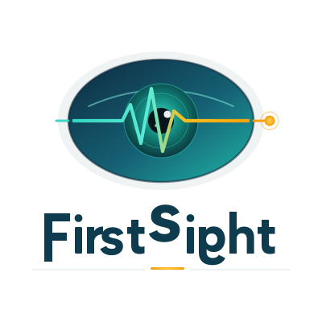

<p align="center">
  
</p>

<p align="center">
  <strong>Real-time health monitoring through smart glasses.</strong><br/>
  Detect emergencies at first sight — hands-free, contactless, always on.
</p>

<p align="center">
  
  
  
  
</p>

---

FirstSight streams live video from Meta smart glasses to an AI-powered backend that silently monitors the people you're looking at. It detects cardiac events, stroke warning signs, and abnormal heart rates — and guides your response in real time — without you ever touching the patient.

---

## The Problem

A bystander watching someone collapse has about **4 minutes** before brain damage begins. In those minutes:

- Heart rate can't be measured without equipment
- Facial stroke signs (FAST — Face, Arms, Speech, Time) are subtle and easy to miss
- Recall under pressure is unreliable; fumbling with a phone costs seconds
- Most wearable monitors require contact, consent, and a device on the patient

FirstSight changes all of that.

---

## Features

### Contactless Heart Rate Detection

Measures pulse from the subtle colour change skin makes with every heartbeat (~1% variation, invisible to the eye). No oximeter. No contact. No interruption.

**How it works:**

The pipeline detects the forehead — the flattest skin region with the strongest pulse signal — and extracts the Blood Volume Pulse (BVP) using a dual-algorithm ensemble:

| Algorithm | Strength | Paper |
|---|---|---|
| **CHROM** | Cancels illumination drift; best on lighter skin | de Haan & Jeanne, 2013 |
| **POS** | Adapts to darker skin via orthogonal skin-vector projection | Wang et al., 2017 |

Every frame, the algorithm with the higher SNR confidence wins. On darker Fitzpatrick types where CHROM can misread (e.g. 96 BPM when the true rate is 72), POS recovers the correct signal at full confidence.

**Alert levels:**

| Status | Meaning |
|---|---|
| `normal` | Within expected range |
| `bradycardia` | Below normal |
| `tachycardia` | Above normal |
| `critical` | Emergency range — adult <40 or >180 BPM, neonate <80 or >220 BPM |
| `no_signal` | Signal too noisy |
| `no_pulse` | No pulse detected (sustained) |

Alerts require ~1 second of consistent readings before firing — a single noisy frame never triggers a false alarm. `alert_changed: true` fires only on status transitions, so the client can trigger audio/haptic alerts exactly once per event.

**Modes:**

| Mode | Normal BPM | Bandpass | Use case |
|---|---|---|---|
| `adult` | 60–100 | 1.0–2.0 Hz | Standard monitoring |
| `neonate` | 100–160 | 2.0–2.67 Hz | NICU / infant monitoring (uses full frame when face is not detected — top-down crib cameras) |

---

### Facial Droopiness Detection

Detects facial asymmetry in real time — a key early indicator of stroke, Bell's palsy, and other neurological events. Catches what a bystander might miss in the first critical seconds.

**Dual approach:**

1. **CNN model** — INT8-quantized EfficientNet-B0 on mouth crops, exported to ONNX for fast CPU inference
2. **Landmark asymmetry** — MediaPipe face landmarker scoring mouth, eye, and brow asymmetry independently

The two scores are fused into a single `droop_probability` per frame, and temporal consistency across frames gives a robust `droop_likelihood` score over video.

**Validated performance (test set, n=881):**

| Metric | Value |
|---|---|
| AUROC | **0.985** |
| Sensitivity | 0.884 |
| Specificity | 0.982 |

**API response (single image):**

```json
{
  "droop_probability": 0.83,
  "is_drooping": true,
  "severity": "severe",
  "confidence": 0.72,
  "face_detected": true,
  "asymmetry_score": 0.071,
  "mouth_asymmetry": 0.082,
  "eye_asymmetry": 0.054,
  "brow_asymmetry": 0.063
}
```

**Video response adds temporal scoring:**

```json
{
  "droop_likelihood": 0.76,
  "fraction_frames_flagged": 0.82,
  "peak_probability": 0.91,
  "temporal_consistency": 0.85,
  "is_drooping": true,
  "severity": "severe"
}
```

---

### Guided First-Aid Playbooks

When an emergency is detected, FirstSight overlays step-by-step response guidance directly in your field of view. No phone. No recalled protocol. No hesitation.

- **Stroke assessment** — FAST check prompted in sequence with timing
- **Cardiac response** — CPR guidance with compression cadence
- **Playbook engine** auto-advances steps as you complete them, driven by what the AI sees through the glasses

---

### Live AI Scene Understanding

Powered by **Gemini Live API**, FirstSight understands context — not just individual signals. It correlates heart rate readings, facial asymmetry, body posture, and scene context to surface the right alert at the right moment.

- Runs continuously in the background
- Provides verbal cues through the glasses' speaker
- Escalates automatically when multiple signals align (e.g. drooping face + elevated heart rate)

---

### Observability

Instrumented with **Logfire** via Pydantic-AI for full-trace visibility into pipeline decisions — useful for debugging, evaluating model accuracy in the field, and compliance logging.

---

## Architecture

```
Meta Smart Glasses (camera + audio)
        │
        ▼
  Mobile App  (iOS / Android — Meta Wearables DAT SDK)
  ├── Streams JPEG frames over WebSocket
  ├── Plays audio alerts through glasses speaker
  └── Receives overlay instructions from backend
        │
        ▼
  Python Backend
  ├── Heart rate pipeline          server/pipeline.py
  │   ├── YOLOR head detector  +  MediaPipe fallback
  │   ├── DeepSort multi-person tracker
  │   └── CHROM / POS rPPG ensemble  →  BPM + alert
  ├── Facial droopiness detector
  │   ├── EfficientNet-B0 (ONNX, INT8)  →  droop_probability
  │   └── MediaPipe landmarks  →  asymmetry_score
  ├── Playbook engine               (guided first-aid steps)
  ├── Gemini Live integration       (scene understanding)
  └── Logfire instrumentation       (observability)
        │
        ▼
  React Debug Viewer   (overlay preview · live transcripts · telemetry)
```

---

## Getting Started

### Prerequisites

- Python 3.10+
- PyTorch (CPU or CUDA)
- iOS or Android device with Meta glasses connected
- Gemini API key

### Backend — heart rate + droopiness server

```bash
git clone https://github.com/dtseng123/droopdetection.git
cd droopdetection

pip install -r requirements.txt

# Place model weights:
#   weights/yolor_head.pt       (YOLOR head detector)
#   model/droop_model.onnx      (EfficientNet droopiness model)
#   model/face_landmarker.task  (MediaPipe face landmarker)

python3 -m uvicorn server.main:app --host 0.0.0.0 --port 8000
```

### Secrets

```bash
cp .env.example .env
cp backend/.env.example backend/.env
cp mobile/CameraAccessAndroid/local.properties.example mobile/CameraAccessAndroid/local.properties
```

Required keys:

| Key | Purpose |
|---|---|
| `GEMINI_API_KEY` | Gemini Live API |
| `github_token` | Android dependency resolution (Meta DAT SDK) |

---

## Heart Rate WebSocket API

```
ws://<host>:8000/ws?mode=adult&fps=30
```

Send JPEG frames as bytes. Receive per-person readings:

```json
{
  "track_id": 1,
  "bpm": 73.4,
  "confidence": 0.963,
  "status": "normal",
  "alert_changed": false
}
```

`confidence` ranges 0–1. Below 0.2 → `no_signal`. `alert_changed: true` fires only on status transitions.

---

## Droopiness REST API

| Endpoint | Input | Description |
|---|---|---|
| `POST /predict` | JPEG/PNG/WebP image (max 10 MB) | Single-frame droopiness analysis |
| `POST /predict/video` | MP4/MOV/AVI/WebM (max 200 MB) | Temporal droopiness over video |
| `GET /health` | — | Service health check |
| `GET /threshold` | — | Model threshold + sensitivity/specificity |

Interactive docs available at `http://localhost:8000/docs`.

---

## Supported Platforms

| Platform | Status |
|---|---|
| Meta smart glasses via iOS DAT SDK | ✅ |
| Meta smart glasses via Android DAT SDK | ✅ |
| Any camera feed over WebSocket | ✅ |
| React debug viewer (WebRTC) | ✅ |

---

## Running Tests

```bash
pytest tests/
```

35 tests covering:

- BPM accuracy, SNR robustness, dark skin correction
- Sustained alert logic, critical thresholds
- Neonate detection and whole-frame fallback
- End-to-end pipeline integration

---

## Evaluating Heart Rate Accuracy

```bash
# MCD-rPPG benchmark dataset
python3 scripts/eval_mcd_rppg.py

# SCAMPS synthetic dataset (MAE ~5.6 BPM on 10 subjects)
python3 scripts/eval_scamps.py

# Run on a video file
python3 scripts/run_video.py path/to/video.mp4 --mode adult
```

---

## Branches

| Branch | Description |
|---|---|
| `main` | Heart rate detection Python backend |
| `feature/heartrate-detection` | Current development branch — CHROM/POS ensemble, alerts, neonate mode |
| `facial-droopines` | Facial asymmetry / stroke detection (EfficientNet + MediaPipe) |
| `smart-glasses-integration` | iOS + Android apps, React viewer, Gemini Live, playbook engine |
| `logfire` | Logfire + Pydantic-AI observability |

---

## Built With

- [Meta Wearables DAT SDK](https://github.com/facebook/meta-wearables-dat-ios) — iOS & Android glasses integration
- [Gemini Live API](https://ai.google.dev/gemini-api/docs/live) — real-time multimodal AI
- [YOLOR](https://github.com/WongKinYiu/yolor) · [DeepSort](https://github.com/nwojke/deep_sort) · [MediaPipe](https://mediapipe.dev/) · [PyTorch](https://pytorch.org/) · [FastAPI](https://fastapi.tiangolo.com/)
- [CHROM rPPG](https://ieeexplore.ieee.org/document/6523142) (de Haan & Jeanne 2013) · [POS rPPG](https://ieeexplore.ieee.org/document/8003267) (Wang et al. 2017)
- [EfficientNet-B0](https://arxiv.org/abs/1905.11946) · [Logfire](https://logfire.pydantic.dev/) · [Pydantic-AI](https://ai.pydantic.dev/)
